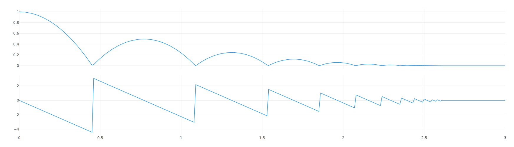
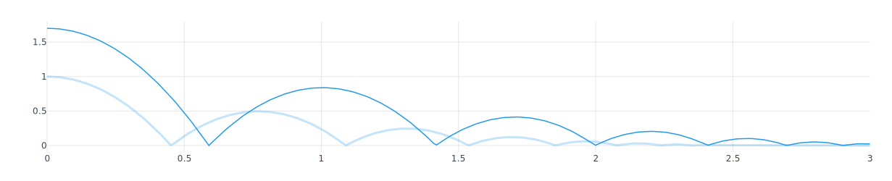
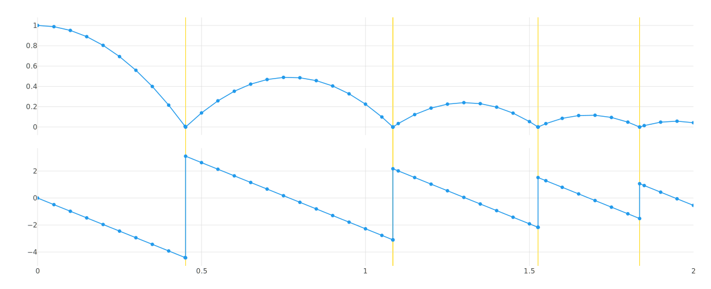

# Tutorial

This tutorial gives a quick tour of the features of fmusim.

!!! tip

    To follow along you can download the [latest release](https://github.com/modelica/Reference-FMUs/releases/latest/download/Reference-FMUs.zip) of the Reference FMUs.
    It contains a set of FMUs with source code and binaries for all common platforms.

## Get information about an FMU

```console
$ fmusim info BouncingBall.fmu

Model Information

FMI Version:       3.0
Interface Types:   Model Exchange, Co-Simulation
Model Name:        BouncingBall
Platforms:         c-code, aarch64-darwin, aarch64-linux, x86-windows, x86_64-darwin, x86_64-linux, x86_64-windows
Continuous States: 2
Event Indicators:  1
Model Variables:   8
Generation Date:   2026-07-10T09:46:15.950713+00:00
Generation Tool:   Reference FMUs (v0.0.40)
Description:       This model calculates the trajectory, over time, of a ball dropped from a height of 1 m

Model Variables

Name   | Description                                                                                                    
-------+----------------------------------------------
time   | Simulation time                                                                                                
h      | Position of the ball                                                                                           
der(h) | Derivative of h                                                                                                
v      | Velocity of the ball                                                                                           
der(v) | Derivative of v                                                                                                
g      | Gravity acting on the ball                                                                                     
e      | Coefficient of restitution                                                                                     
v_min  | Velocity below which the ball stops bouncing  
```

## List the contents of an FMU

```console
$ fmusim list BoucingBall.fmu
binaries/
documentation/
sources/
modelDescription.xml
binaries/aarch64-darwin/
binaries/aarch64-linux/
binaries/x86-windows/
binaries/x86_64-darwin/
binaries/x86_64-linux/
binaries/x86_64-windows/
binaries/aarch64-linux/BouncingBall.so
binaries/x86_64-darwin/BouncingBall.dylib
binaries/aarch64-darwin/BouncingBall.dylib
binaries/x86-windows/BouncingBall.dll
binaries/x86_64-linux/BouncingBall.so
binaries/x86_64-windows/BouncingBall.dll
documentation/result.svg
documentation/index.html
sources/cosimulation.c
sources/config.h
sources/buildDescription.xml
sources/model.h
sources/cosimulation.h
sources/fmi3Functions.c
sources/model.c
```

## Simulate an FMU

### Plot the output

```console
$ fmusim simulate BouncingBall.fmu --show-plot
```

This will open the plot in a new browser window.




### Write the output to a CSV file

```console
$ fmusim simulate BouncingBall.fmu --output-file BouncingBall_out.csv
```

This will write the output to `BouncingBall_out.csv`.

```
time,h,v
0,1,0
0.01,0.99955855,-0.0981
0.02,0.9981361000000002,-0.1962000000000001
0.03,0.9957326500000004,-0.2943000000000001
0.04,0.9923482000000008,-0.39239999999999997
...
```

!!! tip

    Output files can be used as input files using the `--input-file` option. 

### Set start values

We can now set a start value of `1.7` for the variable `h`, set it as our only output variable, and use the previous output as a reference.

```console
$ fmusim simulate BouncingBall.fmu --start-value h=1.7 --output-variable h --reference-file BouncingBall_out.csv
```



!!! tip

    The `--start-value` and `--output-variable` options can be use multiple times.

### Set simulation parameters

Let's use Model Exchange, change some simulation parameters, and log the FMI calls.

```console
$ fmusim simulate BouncingBall.fmu --stop-time 2 --output-interval 0.02 --interface-type me --log-fmi-calls --show-plot --show-events --show-markers
[FMI] fmi3InstantiateModelExchange(instanceName="BouncingBall", instantiationToken="{1AE5E10D-9521-4DE3-80B9-D0EAAA7D5AF1}", resourcePath=None, visible=false, loggingOn=false, 
instanceEnvironment=0x20b3b8f3d70, logMessage=0x7ff7fc08c800) -> 0x20b3b8d2e40
[FMI] fmi3EnterInitializationMode(toleranceDefined=false, tolerance=0, startTime=0, stopTimeDefined=false, stopTime=0) -> fmi3OK
[FMI] fmi3ExitInitializationMode() -> fmi3OK
[FMI] fmi3UpdateDiscreteStates(discreteStatesNeedUpdate=false, terminateSimulation=false, nominalsOfContinuousStatesChanged=false, valuesOfContinuousStatesChanged=false, nextEventTimeDefined=false, 
nextEventTime=0) -> fmi3OK
[FMI] fmi3EnterContinuousTimeMode() -> fmi3OK
[FMI] fmi3GetNumberOfContinuousStates(nContinuousStates=2) -> fmi3OK
[FMI] fmi3GetNumberOfEventIndicators(nEventIndicators=1) -> fmi3OK
[FMI] fmi3GetContinuousStates(continuousStates=[1.0, 0.0], nContinuousStates=2) -> fmi3OK
[FMI] fmi3GetNominalsOfContinuousStates(nominals=[1.0, 1.0], nNominals=2) -> fmi3OK
[FMI] fmi3GetFloat64(valueReferences=[1], nValueReferences=1, values=[1.0], nValues=1) -> fmi3OK
[FMI] fmi3GetFloat64(valueReferences=[3], nValueReferences=1, values=[0.0], nValues=1) -> fmi3OK
[FMI] fmi3SetTime(time=0) -> fmi3OK
[FMI] fmi3SetContinuousStates(continuousStates=[1.0, 0.0], nContinuousStates=2) -> fmi3OK
[FMI] fmi3GetContinuousStateDerivatives(derivatives=[0.0, -9.81], nDerivatives=2) -> fmi3OK
[FMI] fmi3SetTime(time=0.000000000010638260267131509) -> fmi3OK
[FMI] fmi3SetContinuousStates(continuousStates=[1.0, -1.043613332205601e-10], nContinuousStates=2) -> fmi3OK
[FMI] fmi3GetContinuousStateDerivatives(derivatives=[-1.043613332205601e-10, -9.81], nDerivatives=2) -> fmi3OK
...
[FMI] fmi3Termiate() -> fmi3OK
[FMI] fmi3FreeInstance()
```



!!! tip

    Run `fmusim simulate --help` to get a full list of all available options.

## Validate an FMU

```console
$ fmusim validate BouncingBall.fmu
    Validating ZIP archive
    Validating model description
    Validating build description
```

## Build the platform binary

Building the platform binary for a source code FMU requires [CMake](https://cmake.org/) and a supported compiler to be installed.

```console
$ fmusim build BouncingBall.fmu  
Creating CMake project
Configuring CMake project
...
Building CMake project
...
Finished
```

!!! tip

    Run `fmusim list <FMU_FILE>` to see which platform binaries are contained in an FMU.

## Getting help

### Help menus

The `--help` flag can be used to view the help menu for a command, e.g., for `fmusim`:

```console
$ fmusim help
```

To view the help menu for a specific sub command, e.g., for `fmusim simulate`:

```console
$ fmusim help simulate
```

### Viewing the version

When seeking help, it's important to determine the version of fmusim that you're using — sometimes the problem is already solved in a newer version.

To check the installed version:

```console
$ fmusim --version
```
